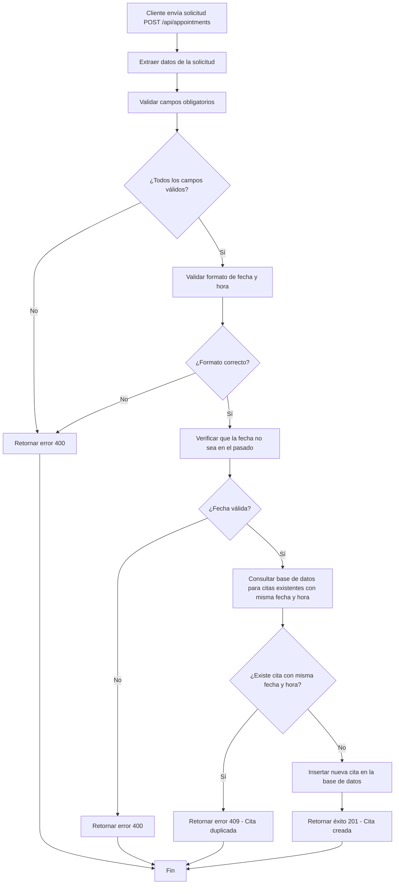

# Estrategia para Prevenir Citas Duplicadas en el Sistema de Citas Médicas

## Descripción del Problema

Actualmente, el sistema de citas médicas no tiene restricciones para prevenir la creación de citas duplicadas con la misma fecha y hora para diferentes clientes. Esto puede llevar a conflictos de programación y confusión para los clientes y el personal médico.

## Estrategia de Prevención

### 1. Validación en la Capa de Aplicación (API)

Antes de insertar una nueva cita en la base de datos, se debe validar que no exista otra cita con la misma fecha y hora. A continuación se presenta el pseudocódigo para la función POST `/api/appointments`:

```
FUNCION POST /api/appointments(request):
  1. EXTRAER client_name, date, time, service_type del cuerpo de la solicitud
  2. VALIDAR que todos los campos obligatorios estén presentes
  3. VALIDAR formato de fecha y hora
  4. VERIFICAR que la fecha no sea en el pasado
  
  5. CONSULTAR base de datos para buscar citas existentes con la misma fecha y hora:
     - QUERY: SELECT id FROM appointments WHERE date = ? AND time = ?
  
  6. SI existen resultados:
     - RETORNAR error HTTP 409 (Conflict) con mensaje "Ya existe una cita programada para esta fecha y hora"
  
  7. SI no existen resultados:
     - INSERTAR nueva cita en la base de datos
     - RETORNAR respuesta HTTP 201 (Created) con los detalles de la cita creada
```

### 2. Implementación en Node.js/Express

```javascript
// app.js o archivo de rutas
app.post('/api/appointments', async (req, res) => {
  try {
    // 1. Extraer datos del cuerpo de la solicitud
    const { client_name, date, time, service_type } = req.body;
    
    // 2. Validar campos obligatorios
    if (!client_name || !date || !time || !service_type) {
      return res.status(400).json({ error: 'Todos los campos son obligatorios' });
    }
    
    // 3. Validar formato de fecha y hora
    const dateRegex = /^\d{4}-\d{2}-\d{2}$/;
    const timeRegex = /^([0-1][0-9]|2[0-3]):[0-5][0-9]$/;
    
    if (!dateRegex.test(date) || !timeRegex.test(time)) {
      return res.status(400).json({ error: 'Formato de fecha u hora inválido' });
    }
    
    // 4. Verificar que la fecha no sea en el pasado
    const currentDate = new Date().toISOString().split('T')[0];
    if (date < currentDate) {
      return res.status(400).json({ error: 'La fecha no puede ser en el pasado' });
    }
    
    // 5. Consultar base de datos para buscar citas duplicadas
    const existingAppointmentQuery = `
      SELECT id FROM appointments 
      WHERE date = $1 AND time = $2
    `;
    const existingAppointmentValues = [date, time];
    
    const result = await db.query(existingAppointmentQuery, existingAppointmentValues);
    
    // 6. Verificar si existe una cita con la misma fecha y hora
    if (result.rows.length > 0) {
      return res.status(409).json({ 
        error: 'Ya existe una cita programada para esta fecha y hora' 
      });
    }
    
    // 7. Insertar nueva cita en la base de datos
    const insertQuery = `
      INSERT INTO appointments (client_name, date, time, service_type)
      VALUES ($1, $2, $3, $4)
      RETURNING *
    `;
    const insertValues = [client_name, date, time, service_type];
    
    const insertResult = await db.query(insertQuery, insertValues);
    
    // 8. Retornar respuesta exitosa
    res.status(201).json(insertResult.rows[0]);
    
  } catch (error) {
    console.error('Error al crear cita:', error);
    res.status(500).json({ error: 'Error interno del servidor' });
  }
});
```

### 3. Solución en la Capa de Base de Datos

Además de la validación en la capa de aplicación, se recomienda implementar una restricción a nivel de base de datos para prevenir duplicados de forma definitiva. Se puede crear un índice único combinado:

```sql
-- Crear índice único para prevenir citas duplicadas con la misma fecha y hora
CREATE UNIQUE INDEX idx_appointments_unique_datetime 
ON appointments (date, time);
```

### 4. Manejo de Concurrencia

En situaciones de alta concurrencia, donde múltiples solicitudes podrían intentar crear citas para la misma fecha y hora simultáneamente, se recomienda usar transacciones con nivel de aislamiento adecuado:

```javascript
app.post('/api/appointments', async (req, res) => {
  try {
    // Iniciar transacción
    await db.query('BEGIN');
    
    // Extraer y validar datos (pasos 1-4 como antes)
    const { client_name, date, time, service_type } = req.body;
    
    // Validaciones (como en el ejemplo anterior)
    if (!client_name || !date || !time || !service_type) {
      return res.status(400).json({ error: 'Todos los campos son obligatorios' });
    }
    
    // Consulta con bloqueo para evitar race conditions
    const existingAppointmentQuery = `
      SELECT id FROM appointments 
      WHERE date = $1 AND time = $2
      FOR UPDATE  -- Bloquea las filas mientras se verifica
    `;
    const result = await db.query(existingAppointmentQuery, [date, time]);
    
    if (result.rows.length > 0) {
      await db.query('ROLLBACK'); // Cancelar transacción
      return res.status(409).json({ 
        error: 'Ya existe una cita programada para esta fecha y hora' 
      });
    }
    
    // Insertar nueva cita
    const insertQuery = `
      INSERT INTO appointments (client_name, date, time, service_type)
      VALUES ($1, $2, $3, $4)
      RETURNING *
    `;
    const insertResult = await db.query(insertQuery, [client_name, date, time, service_type]);
    
    await db.query('COMMIT'); // Confirmar transacción
    
    res.status(201).json(insertResult.rows[0]);
    
  } catch (error) {
    await db.query('ROLLBACK'); // Cancelar transacción en caso de error
    console.error('Error al crear cita:', error);
    
    // Verificar si es un error de restricción única
    if (error.code === '23505') { // Error de restricción única en PostgreSQL
      return res.status(409).json({ 
        error: 'Ya existe una cita programada para esta fecha y hora' 
      });
    }
    
    res.status(500).json({ error: 'Error interno del servidor' });
  }
});
```

## Consideraciones Adicionales

1. **Flexibilidad**: Dependiendo de los requisitos del negocio, es posible que se desee permitir múltiples citas para la misma fecha y hora si son para servicios diferentes o si hay múltiples médicos disponibles.

2. **Rendimiento**: La consulta para verificar duplicados debería ser rápida gracias a los índices existentes en las columnas `date` y `time`.

3. **Manejo de Errores**: Es importante manejar adecuadamente los códigos de estado HTTP:
   - 400: Solicitud inválida (campos faltantes o con formato incorrecto)
   - 409: Conflicto (cita duplicada)
   - 500: Error interno del servidor

4. **Pruebas**: Implementar pruebas unitarias y de integración para verificar que la lógica de prevención de duplicados funcione correctamente, incluyendo pruebas de concurrencia.

## Diagrama de Flujo



## Conclusión

Esta estrategia implementa una doble capa de protección contra citas duplicadas:
1. Validación en la capa de aplicación para proporcionar mensajes de error claros al cliente
2. Restricción en la base de datos como última línea de defensa para garantizar la integridad de los datos

Esta combinación asegura que el sistema sea robusto contra la creación de citas duplicadas incluso en condiciones de alta concurrencia.